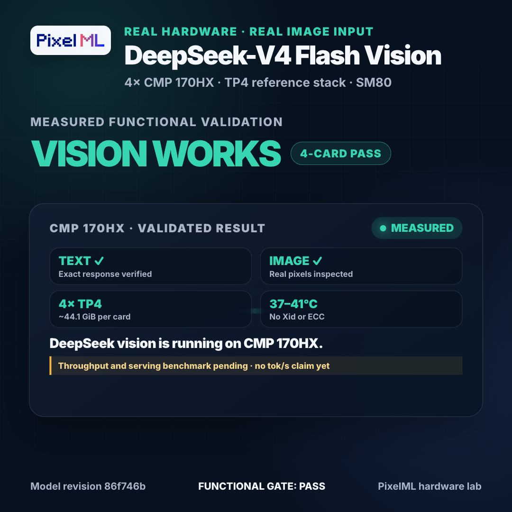

# DeepSeek-V4-Flash-Vision-Exp on 4× CMP 170HX

[](assets/deepseek-v4-vision-validation.mp4)

> **TL;DR — REAL IMAGE INPUT WORKS.** The pinned
> `deepseek-ai/DeepSeek-V4-Flash-Vision-Exp` checkpoint (revision
> `86f746b3`) produced valid text and image responses on four 64 GiB CMP 170HX
> cards using a TP4 reference stack with Ampere-compatible fallbacks. The real
> image gate passed at about **44.1 GiB per card**, **37–41 °C**, with **no Xid
> or ECC event**. This proves functional multimodal inference. It is not yet a
> speed claim: reference-stack serving throughput remains unmeasured.

The earlier vLLM/DSpark path is a separate, text-only performance baseline. Its
historical measurements used incompatible prompt and concurrency protocols, so
they are intentionally not promoted here as canonical results. The active
integration plan pins the complete Vision vLLM implementation, then
forward-ports the proven CMP PP/DSpark semantics with an exact source build.
The first bounded candidate is PP4 + DSpark k=3; k=6 is the divisible fallback
candidate after shape validation, while the historical text-only k=5 setting
is not reused automatically.
A normalized warm greedy 400-token C1/C2/C4/C8/C16 rerun remains the publication
gate. The C1 optimization target is at least 100 tok/s without weakening
correctness or stability.

Evidence: [experiment notebook](notebooks/cmp-170hx-experiment.ipynb) ·
[real-image smoke receipt](results/receipts/vision-reference-smoke.json) ·
[text-path measurements](results/receipts/measurements.json) ·
[Vision vLLM integration plan](docs/VLLM-VISION-INTEGRATION.md) ·
[normalized benchmark harness](bench_normalized.py)

## What passed

| Gate | Result | Evidence |
| --- | --- | --- |
| Model identity | PASS | Pinned revision `86f746b36186f0e567729a5c06a8c918caba82a9` |
| SM80 fallback unit suite | PASS | 7/7 tests, including FP8 block-scale and FP4 dequantization |
| TP4 load | PASS | Four reference shards; about 44.1 GiB resident per card |
| Text smoke | PASS | Exact one-word completion `OK` |
| Real image smoke | PASS | Model identified the synthetic fixture's pink/blue/green/yellow color families |
| OpenAI-compatible private server | IN PROGRESS | `/v1/models`, text, and data-URL image gates are the final serving check |
| Reference-stack throughput | NOT MEASURED | No tok/s claim yet |

The image fixture is a red-to-green vertical gradient with a constant blue
channel. Its colors cannot be inferred from the prompt alone, so the inspected
answer is evidence that the visual pixels reached the model.

## Vision-capable reference recipe

This path uses the upstream-style TP4 model implementation plus targeted SM80
fallbacks. It does not relabel the result as vLLM, SGLang, or DFlash2.

1. Convert the pinned Hugging Face snapshot to the four-shard reference layout
   with `research/vision-port/convert.py`.
2. Build or select the CUDA runtime used by the experiment and put
   `patches/` before optional CUDA extensions on `PYTHONPATH`.
3. Run `scripts/sm80_unit_test.py`; all seven gates must pass before a full
   load.
4. Launch `research/vision-port/run_sm80.py` under four-rank `torchrun` for
   bounded text and image smokes.
5. Launch `research/vision-port/openai_server.py` only after live ownership,
   storage, and accelerator-health gates pass.

The server defaults to loopback and a public-neutral model ID. A private bind
address and deployment-specific alias must be selected explicitly:

```bash
torchrun --standalone --nproc-per-node=4 \
  research/vision-port/openai_server.py \
  --ckpt-path "$TP4_CHECKPOINT" \
  --config research/vision-port/inference-config.json \
  --host "$PRIVATE_BIND_IP" \
  --port 8000 \
  --model-id "$PRIVATE_MODEL_ALIAS"
```

Safety properties:

- default bind: `127.0.0.1`, never a public interface;
- images: `data:image/...;base64,...` only at the HTTP boundary;
- topology: TP4, one in-flight request at a time;
- weights: mounted read-only from the canonical model store during validation;
- publication: no private endpoint, host, mount, or control-plane identifier.

## SM80 fixes required for real vision

The depth-first port exposed independent compatibility gaps. Each was fixed
and unit-tested before the next full load:

- FP8 and FP4 scale tensors are block grids, not per-row scales; the fallback
  expands `[N/128, K/group]` grids over the dequantized weight.
- The checkpoint's split-sinkhorn tensor is a flat
  `[pre(m) | post(m) | combined(m×m)]` layout, not an `(m, m+2)` grid.
- The unavailable fast Hadamard CUDA extension is replaced with a pure-Torch
  Sylvester transform whose `H @ H.T == n * I` invariant is tested.
- Sparse attention fallback tests cover uniform top-k and attention-sink
  semantics on SM80.

See [SM80-SCALE-FIX.md](research/vision-port/SM80-SCALE-FIX.md) and
[`scripts/sm80_unit_test.py`](scripts/sm80_unit_test.py).

## Text-only vLLM/DSpark performance protocol

This runtime answers a different question: how fast the language backbone can
run through the proven SM80 text-serving fork. It rejects image input and is
not the real-vision path above.

The canonical rerun uses one fixed prompt, greedy decoding, 400 completion
tokens, one warmup, and at least three measured repetitions at C1, C2, C4, C8,
and C16. It records final usage objects, TTFT, success rate, inspected output,
and actual per-request distribution. A failed C16 receives a failure label and
no numeric point.

Historical text-path recipe: PP4 partition `11,11,11,10`, FP8 KV cache, block
size 256, max 2,048 batched tokens, max 8 sequences, DSpark k=6, greedy
400-token requests. This is control evidence only. The real-image vLLM path
must first pass the exact-source Vision integration and functional gates in the
[integration plan](docs/VLLM-VISION-INTEGRATION.md).

| Canonical metric | Unit and denominator | Publication status |
| --- | --- | --- |
| Aggregate decode | successful completion tokens / synchronized level wall second | Normalized rerun pending |
| Per-request decode | one request's completion tokens / that request's elapsed second | Normalized rerun pending |
| TTFT | seconds from request start to first streamed content token | Normalized rerun pending |

At C1, aggregate and per-request decode are the same denominator and must be
identical. At higher concurrency they are different measurements and are never
compared as though interchangeable. Historical receipts remain in `results/`
for auditability but are explicitly non-comparable and superseded for public
claims.

## Current limitations

- The reference implementation proves correctness, not production throughput.
- The private server is intentionally single-request and non-streaming in this
  validation pass.
- The SM80 fallback is pure Torch in critical operators and is expected to be
  substantially slower than optimized kernels.
- Cold load streams four large shards from shared model storage; storage I/O
  dominates startup.
- The text-only vLLM numbers must remain labeled as a different runtime.

## Attribution

The text-serving recipe and benchmark structure are adapted from
[PixelML/DeepSeek-V4-Flash-0731-CMP-170HX](https://github.com/PixelML/DeepSeek-V4-Flash-0731-CMP-170HX)
and the
[allover326 CMP 170HX reference stack](https://github.com/allover326/deepseek-v4-cmp170hx).
The vision port follows the official DeepSeek-V4-Flash-Vision-Exp reference
implementation. Full credits are in [ATTRIBUTION.md](ATTRIBUTION.md).
