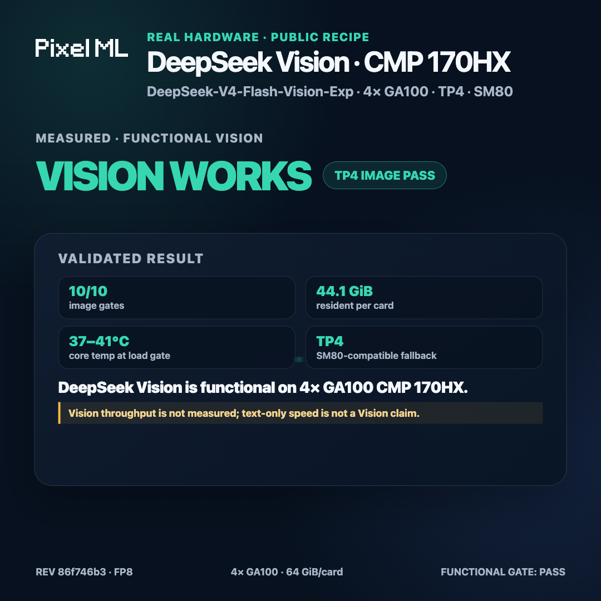

# DeepSeek-V4-Flash-Vision-Exp on 4x CMP 170HX

**Vision is verified on 4x CMP 170HX: `deepseek-ai/DeepSeek-V4-Flash-Vision-Exp` serves real image input at 119 tok/s median decode (peak 162) on text-only requests and 45/78 tok/s aggregate with an image in the request at concurrency 1/2, with 10/10 image-row golden-corpus keyword match.**

This repository is the sanitized, reproducible evidence trail for that
result: patches, launch scripts, and dated, receipted measurements for both
the text-only and vision-enabled SM80 vLLM builds.

[](docs/benchmark-video.mp4)

The video is an 8-second mobile-readable publication cut. Its editable
HyperFrames source and public data payload are in
[`docs/benchmark-video/`](docs/benchmark-video/) and
[`results/benchmark-video.json`](results/benchmark-video.json).

## Verified configuration

| Component | Pin |
| --- | --- |
| Model | [`deepseek-ai/DeepSeek-V4-Flash-Vision-Exp`](https://huggingface.co/deepseek-ai/DeepSeek-V4-Flash-Vision-Exp) |
| Model revision | `86f746b36186f0e567729a5c06a8c918caba82a9` |
| Checkpoint | FP8 e4m3, 48 safetensor shards, 167,831,846,872 bytes |
| Served model id | `deepseek-v4-flash-vision-exp` |
| Fork lineage | `allover326` SM80 fork of vLLM, commit `f8ea5bb163c161ef38b401d055cc5fd4a934091a`, plus an 8-file SM80/DSpark patch set, plus the vision port in `patches/path3-vision-sm80-fork/` (5 files baked in; see `docs/VISION-PORT.md`) |
| Text-path image | `ghcr.io/pixelml/club-170hx:vllm-deepseek-v4-sm80-20260902` (digest `sha256:90a1419e8ceaad3542153ef4e2a1d94a69b9af03cce7b0a1b267dd1dad55b9d7`) |
| Vision-path image | `ghcr.io/pixelml/club-170hx:vllm-deepseek-v4-vision-sm80-20260902` (digest `sha256:b26232f8f041c988d3285e2278c9f5001cc49f96131bb0b22a9d38b5e5e061cd`) |
| Topology | 4 cards, pipeline-parallel 4, layer partition `11,11,11,10` |
| Speculative decoding | DSpark, k=6 |
| KV cache dtype | `fp8` |
| Context (current pin) | `--max-model-len 262144` |
| Power cap | 180 W per card (standing default; 250 W measured no gain, see Limitations) |

Only `11,11,11,10` boots cleanly on 4 cards. Two other partitions failed
before serving traffic: `12,12,12,7` exits 137, `12,12,11,8` hits a
device-side assert on the first request.

## Measured performance

### Text path, four cards, PP4 + DSpark k=6 (2026-09-02, normalized ladder)

Greedy decoding, 400 completion tokens, `ignore_eos`, one warmup plus three
reps per level, tokens counted from the final `usage` object.

| Concurrency | Aggregate decode | Notes |
| --- | ---: | --- |
| c=1 | 97.4 tok/s (median of 3; range 57.6-123.5) | |
| c=2 | 103.7 tok/s (median of 3; range 96.6-159.2) | |
| c=4 | 165.5 tok/s (median of 3; range 140.3-203.2) | |
| c=8 | **220.2 tok/s** (median of 3; range 206.3-232.0) | Best measured aggregate |
| c=16 | Failed | Device-side assert in the draft-decode path, reproduced twice |

Uncached prefill (2,941 tokens): 2,352 tok/s warm. Warm TTFT: 0.394 s.
Full detail and receipts:
[`results/2026-09-02-deepseek-v4-flash-vision-exp-4card-pp4-vllm.md`](results/2026-09-02-deepseek-v4-flash-vision-exp-4card-pp4-vllm.md).

### Vision path, four cards, PP4 + DSpark k=6 (2026-09-02, partial)

| Metric | Value |
| --- | ---: |
| Functional gates | PASS, 3/3 identical reps |
| Golden corpus, image rows (10) | PASS, 10/10 keyword match |
| Golden corpus, text rows (20) | 15/20 keyword match, 10/20 exact-match vs. DGX Spark reference (oracle pending) |
| Decode, c=1, text-only | 119 tok/s median of 5 reps (peak 162), aggregate |
| Decode, c=2, text-only | 116.57 tok/s aggregate (median of 3) |
| Decode, c=4, text-only | FAIL — server crashed, rep 3 of 3 |
| Decode, c=1, text+image | 45.32 tok/s aggregate (median of 3) |
| Decode, c=2, text+image | 78.23 tok/s aggregate (median of 3) |
| Uncached prefill, 2,941 tokens | 2,352.42 tok/s (median of 3) |
| Warm streaming TTFT | 0.386 s (median of 3) |

Concurrency c=4 and above is untested on the vision-enabled build (text+image)
given the text-only c=4 crash. Full detail and receipts:
[`results/2026-09-02-deepseek-v4-flash-vision-exp-4card-vision-pp4-vllm.md`](results/2026-09-02-deepseek-v4-flash-vision-exp-4card-vision-pp4-vllm.md).

### Long-context prefill ladder, `--max-model-len 262144` (2026-09-02)

| Prompt tokens | Status | Median prefill tok/s |
| ---: | --- | ---: |
| 2,941 | PASS | 2,397 |
| 16,000 | PASS | 4,665 |
| 32,000 | PASS | 5,182 |
| 65,000 | PASS | 5,261 |
| 131,000 | FAIL — engine crash (Triton fault, DSpark/DFlash speculator) | — |

Largest prompt verified end to end: 65,000 tokens. Full detail:
[`results/2026-09-02-deepseek-v4-flash-vision-exp-4card-longctx-262k.md`](results/2026-09-02-deepseek-v4-flash-vision-exp-4card-longctx-262k.md).

### Reproducibility and power cap (2026-09-02)

5-rep check on the vision-build text-only c=1 recipe: 118.95 tok/s median
at 180 W (range 48.5-161.7), 120.42 tok/s median at 250 W (range 86.9-154.7)
— statistically indistinguishable at this concurrency; 250 W buys no
measured throughput gain. Full detail:
[`results/2026-09-02-deepseek-v4-flash-vision-exp-4card-repro-power.md`](results/2026-09-02-deepseek-v4-flash-vision-exp-4card-repro-power.md).

### Cross-platform line (not a head-to-head)

The same checkpoint at the same revision also serves on a two-node DGX
Spark kit (GB10, vLLM, TP=2, DSpark k=6): decode c=1 36.9 tok/s, c=6
112.7 tok/s aggregate, uncached prefill 1,789 tok/s, vision PASS. Full
numbers and cost/watt context:
[`results/2026-09-02-cross-platform-cost-watt.md`](results/2026-09-02-cross-platform-cost-watt.md).

## Reproduce

1. A 4-card CMP 170HX node (SM80, 64 GiB/card), with local NVMe staging
   recommended — see [docs/TROUBLESHOOTING.md](docs/TROUBLESHOOTING.md),
   "NFS vs. NVMe boot times."
2. Copy the config template and fill in your local paths:

   ```bash
   cp .env.example .env
   $EDITOR .env
   ```

3. Pull the pinned runtime image (vision path shown; swap in the text-path
   tag for text-only):

   ```bash
   docker pull ghcr.io/pixelml/club-170hx:vllm-deepseek-v4-vision-sm80-20260902
   ```

4. Download the checkpoint, pinned to the exact revision, and verify 48/48
   shards before serving:

   ```bash
   pip install -U huggingface_hub
   hf download deepseek-ai/DeepSeek-V4-Flash-Vision-Exp \
     --revision 86f746b36186f0e567729a5c06a8c918caba82a9 \
     --local-dir "$WEIGHTS_PATH"
   ```

5. Launch and probe:

   ```bash
   ./scripts/launch-vision-server.sh
   python3 scripts/probe.py --url http://127.0.0.1:18099/v1 \
     --model deepseek-v4-flash-vision-exp --vision
   ```

6. Run the bench harness against the running endpoint:

   ```bash
   DSV4_URL=http://127.0.0.1:18099 DSV4_MODEL_NAME=deepseek-v4-flash-vision-exp \
     python3 scripts/bench_harness.py
   ```

The server then exposes an OpenAI-compatible API at
`http://<host>:<VISION_PORT>/v1`. Keep it off the public internet unless it
sits behind an authenticated TLS proxy; see
[docs/API.md](docs/API.md).

## Limitations

- **Concurrency c=4 and above crashes.** The `EngineCore` process dies mid-batch
  (`RuntimeError: cancelled` in `shm_broadcast.py acquire_read`) at c=4 on
  the vision-enabled build. Not a hardware fault — no Xid, no ECC event, the
  container exits cleanly. Interim cap: stay at c=2 or below. See
  [docs/TROUBLESHOOTING.md](docs/TROUBLESHOOTING.md).
- **131,000-token prompt crashes at `--max-model-len 262144`.** A distinct
  Triton fault in the DSpark/DFlash speculator's input-preparation step
  fails on the drafter rank between the 65,000 and 131,000-token rungs. The
  largest prompt verified end to end is **65,000 tokens**.
- **Text exact-match is 10/20 vs. the DGX Spark reference, pending oracle
  confirmation.** The golden-corpus text rows score 15/20 on keyword match
  but only 10/20 exact-match against a cross-platform reference that is
  itself pending independent verification. The image-row result (10/10) does
  not depend on this oracle.
- **250 W buys no measured throughput gain over 180 W** at c=1/c=2 on this
  workload — see "Reproducibility and power cap" above. 180 W stays the
  standing default.
- **Single-stream and low-concurrency numbers only past c=2 on the vision
  build.** c=8 and c=16 are measured on the text-only image, not the
  vision-enabled one.

## Links

- Club notebook and platform guide: [PixelML/club-170hx, `docs/models/deepseek-v4-flash-vision-exp.md`](https://github.com/PixelML/club-170hx/blob/main/docs/models/deepseek-v4-flash-vision-exp.md)
- Club release (text + vision, 2026-09-02): [`dsv4-vision-exp-4card-2026-09-02`](https://github.com/PixelML/club-170hx/releases/tag/dsv4-vision-exp-4card-2026-09-02)
- Hugging Face collection: [PixelML/club-170hx: verified on CMP 170HX (SM80)](https://huggingface.co/collections/PixelML/club-170hx-verified-on-cmp-170hx-sm80-6a97bf4edc20b52c5cf454e3)
- Sibling DGX Spark evidence repository: [PixelML/DeepSeek-V4-Flash-Vision-Exp-DGX-Spark](https://github.com/PixelML/DeepSeek-V4-Flash-Vision-Exp-DGX-Spark)
- Executed notebook: [`notebooks/cmp-170hx-experiment.ipynb`](notebooks/cmp-170hx-experiment.ipynb)

## Repository layout

- `patches/` - the SM80 fork's DSpark patch set and the vision-port commit series (`patches/path3-vision-sm80-fork/`), plus targeted fallback shims.
- `scripts/` - `launch-vision-server.sh` / `launch-text-server.sh` launch scripts with placeholders in place of any private host or path, `bench_harness.py`, `probe.py`, and evidence-validation tooling.
- `results/` - dated, sanitized markdown summaries for every measurement in this README, plus raw JSON/CSV receipts under `results/receipts/`.
- `docs/API.md` - OpenAI-compatible usage, including an image `data:` URL example and tool-call usage.
- `docs/TROUBLESHOOTING.md` - the boot fixes and known failure signatures.
- `docs/DOCKER-IMAGE.md` - published image digests, source lineage, and the pre-publication security scan.
- `docs/VISION-PORT.md` - what the vision port adds to the SM80 fork and the five boot fixes it took to reach READY.
- `notebooks/` - the executed experiment notebook.

## Attribution

The launch recipe, SM80 patch set, and benchmark structure are adapted from
[PixelML/DeepSeek-V4-Flash-0731-CMP-170HX](https://github.com/PixelML/DeepSeek-V4-Flash-0731-CMP-170HX)
and the
[allover326 CMP 170HX reference stack](https://github.com/allover326/deepseek-v4-cmp170hx);
full credits in [ATTRIBUTION.md](ATTRIBUTION.md).

## License

MIT. Benchmark code and documentation only - no model weights. The
checkpoint is governed by its own license on the
[upstream model card](https://huggingface.co/deepseek-ai/DeepSeek-V4-Flash-Vision-Exp).
